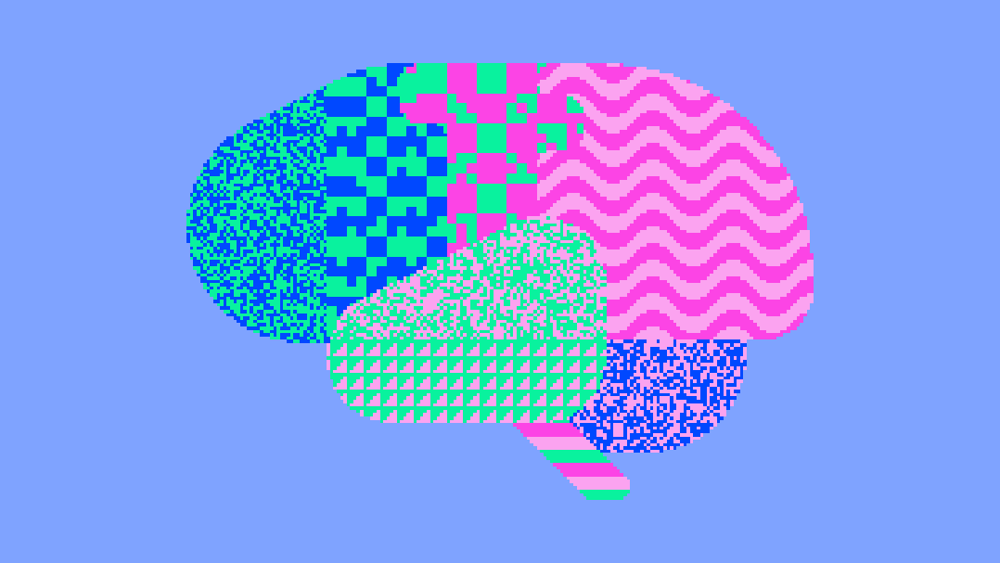

## H I Y A !   I ' M   C O O P E R

  

I'm a meuro/data scientist with expertise in ML, predictice modeling, research, computational neuroscience, and human behavior.

Currently, I'm a postdoctoral researcher at Caltech where I investigate how the brain learns, evaluates choices, and makes decision. In particular, I study complex forms of planning that include abstraction and internal models of the causal structure in the world.

### R E S E A R C H
 
- Model-based hierarchical reinforcemnet learning models of behavior
- Human single-unit electrophysiology and fMRI
- Experimental design, causal inference, and mechanistic understanding of complex systems
- Reproducible analysis/ML tools for neural and behavioral data

### P E R S O N A L   P R O J E C T S

- **[overtraining-detection](https://github.com/coopergrossman/overtraining-detection)** — Personalized overtraining detection from Strava activity and Garmin sleep data using LSTM models for next-day recovery prediction.

### T O O L S
 
**Languages** — Python · R · MATLAB · SQL 
**Python** — NumPy · pandas · PyTorch · scikit-learn · Stan · statsmodels 
**Modeling** — hierarchical Bayesian · reinforcement learning · causal inference

### C O N N E C T
 
- [Google Scholar](https://scholar.google.com/citations?user=XVVSGikAAAAJ&hl=en)
- [LinkedIn](https://www.linkedin.com/in/cooper-d-grossman/)
